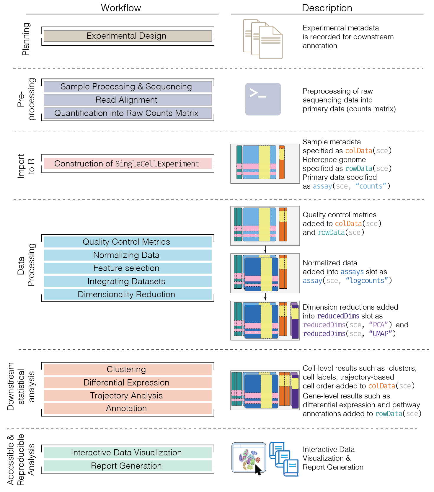
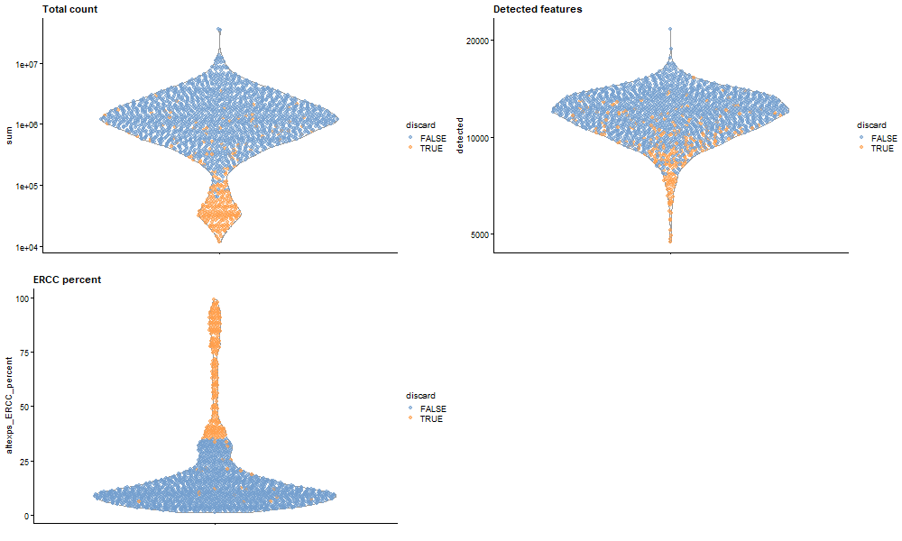
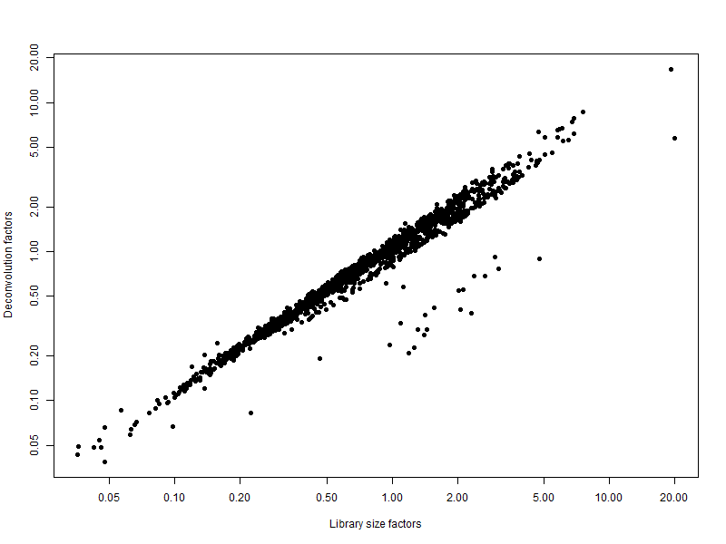
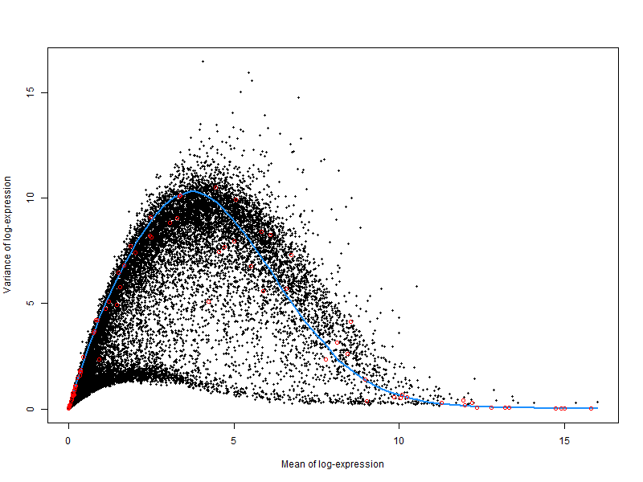
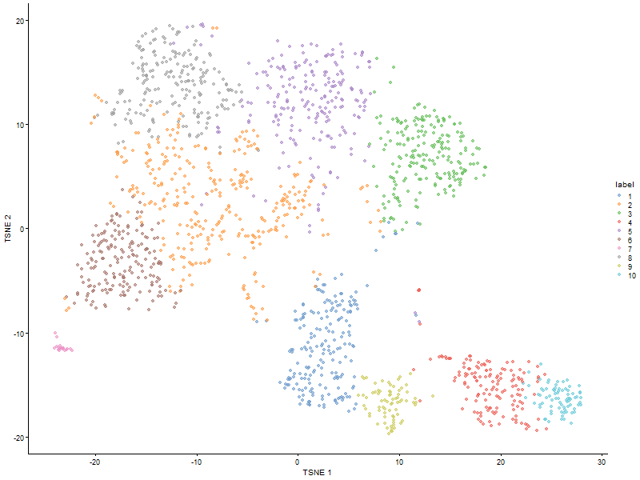
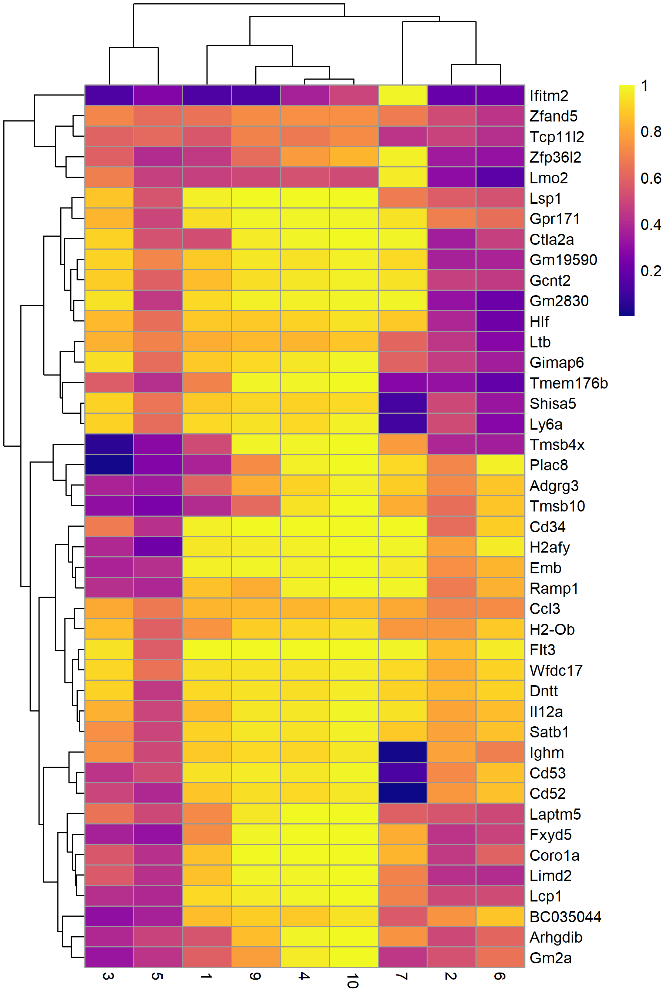
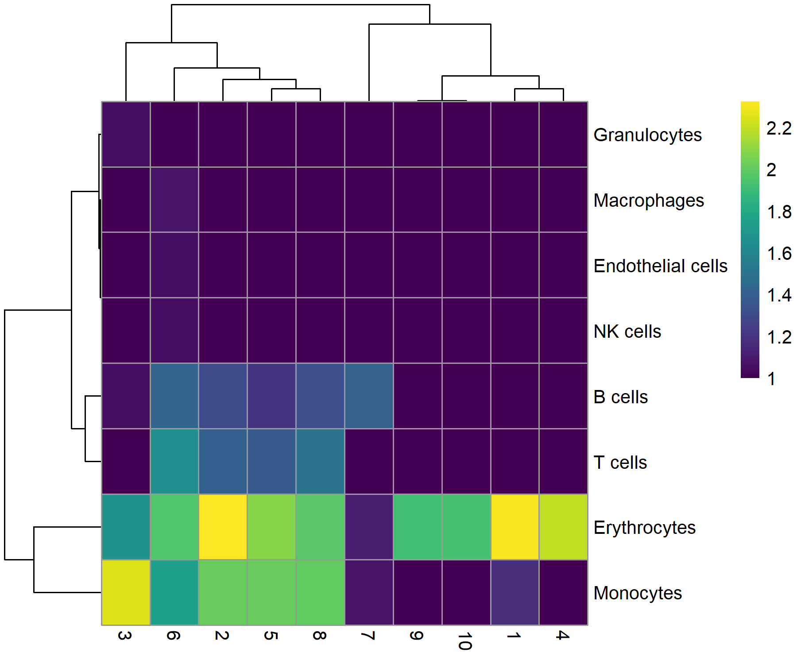

# Single-cell RNA-seq Analysis of Mouse Hematopoietic Stem and Progenitor Cells Using Bioconductor
**Kwesi Kumi, Noah Cupp, Duong Nguyen, Kashif Mashood**

## INTRODUCTION

Single cell RNA sequencing measures gene expression in individual cells.
It is able to provide significant insight on cellular diverstiy as it is
used to detect changes in gene expression during the onset and
progression of diseases or treatment response.

## PACKAGE INSTALLATION

Here is the code to install the various dependencies

``` r
if (!require("BiocManager", quietly = TRUE))
    install.packages("BiocManager")

BiocManager::install(c(
   "scRNAseq", "AnnotationHub", "scater", "scran", "SingleR", "celldex",
   "pheatmap", "viridis", "gridExtra", "igraph"
 ))
```

## DATA OVERVIEW

The data that was chosen for this analysis was a the Nestorowa
hematopoietic stem cell single-cell RNA-seq dataset from the scRNAseq
Bioconductor package. The dataset contains 46,078 genes across 1,920
cells and is stored as a SingleCellExperiment object, eliminates the
need for raw data import and ensures a standardized structure where
counts, gene annotations, and cell metadata are already, which allowed
us to perform quality control, annotation, normalization, and
visualization using standard Bioconductor tools.

## DATA LOADING AND ANNOTATION

``` r
#Load the dataset
library(scRNAseq)
library(AnnotationHub)

sce.nest <- NestorowaHSCData()

# Annotation
ens.mm.v97 <- AnnotationHub()[["AH73905"]]
anno <- select(ens.mm.v97, keys=rownames(sce.nest), 
    keytype="GENEID", columns=c("SYMBOL", "SEQNAME"))
rowData(sce.nest) <- anno[match(rownames(sce.nest), anno$GENEID),]

#Inspect the resulting SingleCellExperiment object
sce.nest
```

    class: SingleCellExperiment 
    dim: 46078 1920 
    metadata(0):
    assays(1): counts
    rownames(46078): ENSMUSG00000000001 ENSMUSG00000000003 ...
      ENSMUSG00000107391 ENSMUSG00000107392
    rowData names(3): GENEID SYMBOL SEQNAME
    colnames(1920): HSPC_007 HSPC_013 ... Prog_852 Prog_810
    colData names(9): gate broad ... projected metrics
    reducedDimNames(1): diffusion
    mainExpName: endogenous
    altExpNames(2): ERCC FACS

## METHOD OVERVIEW OF WORKFLOW

Overview of the framework of a typical scRNA-seq analysis workflow


*Figure 1: Overview of the single-cell RNA-seq analysis workflow adapted
from a Bioconductor pipeline.*

No count loading step was required in this analysis because the
Nestorowa dataset was accessed directly through the scRNAseq package as
a pre-constructed SingleCellExperiment object. This means the data is
already loaded and pre-processed, with counts stored in memory, rows
representing genes, columns representing individual cells, and
associated metadata already included within the object. Unlike the
original workflow that begins with manually importing raw count files
from GEO , this approach allows us to skip data loading and focus
directly on downstream analysis steps such as quality control,
normalization, and visualization.

### Quality Control

Quality control (QC) was conducted to remove low-quality cells based on
metrics such as library size, number of detected genes, and
mitochondrial gene expression. Thresholds were applied using median
absolute deviation (MAD)-based outlier detection, following standard
Bioconductor single-cell analysis workflows .

A copy of the dataset was saved prior to quality control to allow
comparison between filtered and unfiltered cells. This enabled
visualization of which cells were removed based on QC metrics.

``` r
unfiltered <- sce.nest
```

Quality control metrics were calculated for each cell, including library
size, detected genes, and ERCC spike-in percentage. Low-quality cells
were automatically identified using MAD-based thresholds and removed
from the dataset to ensure reliable downstream analysis.

``` r
library(scater)

# Computes quality metrics for each cell, calculates total counts (library size), number of detected genes, percentage of counts from subsets (e.g., ERCC) -> help identify low-quality cells
stats <- perCellQCMetrics(sce.nest)

# Automatically flags poor-quality cells
qc <- quickPerCellQC(stats, percent_subsets="altexps_ERCC_percent")

#Removes low-quality cells from the dataset
sce.nest <- sce.nest[,!qc$discard]
```

``` r
# counts how many cells were flagged for each QC criterion.
colSums(as.matrix(qc))
```

                 low_lib_size            low_n_features high_altexps_ERCC_percent 
                          146                        28                       241 
                      discard 
                          264 

Quality control identified cells with low library size (146 cells), low
detected features (28 cells), and high ERCC spike-in percentage (241
cells). A total of 264 cells were removed after combining these
criteria. The high number of cells with elevated ERCC proportions
suggests that technical noise was the primary factor influencing cell
quality in this dataset.

QC metrics were added to the dataset and visualized to assess cell
quality. Cells were colored based on whether they were retained or
discarded. Low-quality cells showed lower library sizes, fewer detected
genes, and higher ERCC spike-in proportions, confirming that these
metrics effectively distinguish technical artifacts from high-quality
cells.

``` r
if (!dir.exists("images")) dir.create("images")
png("images/qc_plot.png", width = 1000, height = 600)

colData(unfiltered) <- cbind(colData(unfiltered), stats)
unfiltered$discard <- qc$discard

gridExtra::grid.arrange(
    plotColData(unfiltered, y="sum", colour_by="discard") +
        scale_y_log10() + ggtitle("Total count"),
    plotColData(unfiltered, y="detected", colour_by="discard") +
        scale_y_log10() + ggtitle("Detected features"),
    plotColData(unfiltered, y="altexps_ERCC_percent",
        colour_by="discard") + ggtitle("ERCC percent"),
    ncol=2
)
dev.off()
```

 *Figure 2: Distribution of quality
control (QC) metrics across cells in the Nestorowa dataset. Each point
represents a cell and is colored according to whether it was retained
(blue) or discarded (orange) after QC filtering.*

### Normalization

Normalization was performed to adjust gene expression values across
cells and remove technical differences such as sequencing depth and
capture efficiency.

``` r
library(scran)
set.seed(101000110)
# Group cells into clusters to pool similar cells -> improve normalization accuracy
clusters <- quickCluster(sce.nest) 

# Estimates scaling factors for each cell based on pooled expression counts
sce.nest <- computeSumFactors(sce.nest, clusters=clusters)

#normalized log-expression values
sce.nest <- logNormCounts(sce.nest)
```

Normalization was performed using a deconvolution-based method
implemented in the scran package to account for differences in
sequencing depth and capture efficiency across cells. Normalized
log-expression values were calculated for downstream analysis.

Summarizes normalization factors across cells to checks whether
normalization behaved reasonably (values centered around 1)

``` r
summary(sizeFactors(sce.nest))
```

        Min.  1st Qu.   Median     Mean  3rd Qu.     Max. 
     0.03876  0.42023  0.74297  1.00000  1.24900 16.78896 

Compare library size factors (simple normalization) vs deconvolution
factors (scran) to confirms normalization is consistent and Shows that
scran adjusts for additional technical biases beyond total counts

``` r
# Save plot
png("images/normalization_plot.png", width = 800, height = 600)

plot(librarySizeFactors(sce.nest), sizeFactors(sce.nest), pch=16,
    xlab="Library size factors", ylab="Deconvolution factors", log="xy")

dev.off()
```

 *Figure 3:
Relationship between the library size factors and the deconvolution size
factors in the Nestorowa HSC dataset.*

The plot compares simple normalization (library size) with scran
normalization. Each point represents a cell. The positive relationship
indicates that both methods capture differences in sequencing depth,
while deviations from a straight line show that scran normalization
adjusts for additional technical variation beyond total counts.

### Variance modelling

Variance modelling was performed to distinguish biological variation
from technical noise in gene expression data and to identify highly
variable genes (HVGs) for downstream analysis.

The spike-in transcripts is used to model the technical noise as a
function of the mean

``` r
set.seed(00010101)
dec.nest <- modelGeneVarWithSpikes(sce.nest, "ERCC")
top.nest <- getTopHVGs(dec.nest, prop=0.1)
```

A plot was generated to visualize the relationship between mean
expression and variance. The blue curve represents expected technical
noise estimated from ERCC spike-ins. Genes above the curve show higher
variability and are selected as highly variable genes (HVGs).

``` r
png("images/variance_plot.png", width = 800, height = 600)

plot(dec.nest$mean, dec.nest$total, pch=16, cex=0.5,
    xlab="Mean of log-expression", ylab="Variance of log-expression")
curfit <- metadata(dec.nest)
curve(curfit$trend(x), col='dodgerblue', add=TRUE, lwd=2)
points(curfit$mean, curfit$var, col="red")

dev.off()
```



*Figure 4: Per-gene variance as a function of the mean for the
log-expression values in the Nestorowa HSC dataset. Each point
represents a gene (black) with the mean-variance trend (blue) fitted to
the spike-ins (red).*

### Dimensionality Reduction

Dimensionality reduction was performed to simplify the high-dimensional
gene expression data into a few summary variables (principal
components). Only the important signals are kept, and noise is removed.
Then t-SNE is used to visualize how cells group together.

``` r
set.seed(101010011)
sce.nest <- denoisePCA(sce.nest, technical=dec.nest, subset.row=top.nest)
sce.nest <- runTSNE(sce.nest, dimred="PCA")
```

The number of retained principal components was checked:

``` r
ncol(reducedDim(sce.nest, "PCA"))
```

    [1] 9

### Clustering

Clustering helps identify groups of cells with similar expression
patterns, which often correspond to different cell types or biological
states. Using an SNN graph improves robustness by considering shared
neighbors rather than direct distances, making it well-suited for noisy
single-cell data. The Walktrap algorithm detects communities within this
graph, allowing discovery of meaningful cell populations.

``` r
snn.gr <- buildSNNGraph(sce.nest, use.dimred="PCA")
colLabels(sce.nest) <- factor(igraph::cluster_walktrap(snn.gr)$membership)
```

Counts how many cells are in each cluster.

``` r
table(colLabels(sce.nest))
```


      1   2   3   4   5   6   7   8   9  10 
    198 319 208 147 221 182  21 209  74  77 

A t-SNE plot was generated to visualize cell clustering. Cells are
grouped based on gene expression similarity, and colored by cluster
labels. Distinct clusters indicate the presence of multiple cell
populations within the dataset.

``` r
png("images/tsne_clusters.png", width = 800, height = 600)

plotTSNE(sce.nest, colour_by="label")

dev.off()
```



*Figure 5: t-SNE plot of the Nestorowa HSC dataset, where each point
represents a cell and is colored according to the assigned cluster.*

### Marker gene detection

After clustering, marker genes help explain what each cluster represents
biologically. For example, if a cluster has high expression of known
erythroid genes, that cluster may represent erythroid precursor cells.

``` r
markers <- findMarkers(sce.nest, colLabels(sce.nest), 
    test.type="wilcox", direction="up", lfc=0.5,
    row.data=rowData(sce.nest)[,"SYMBOL",drop=FALSE])
```

To illustrate the manual annotation process, marker genes for one
cluster were examined. In this example, marker gene results for cluster
8 were selected, and the top-ranked genes were retained. Their AUC
values were extracted to assess how well each gene distinguishes cluster
8 from other clusters. Genes with higher AUC values provide better
separation of this cluster. The upregulation of genes such as Car2,
Hebp1, and hemoglobin-related genes suggests that cluster 8 represents
erythroid precursor cells.

``` r
library(pheatmap)
chosen <- markers[['8']]
best <- chosen[chosen$Top <= 10,] # Keep top 10 marker genes
aucs <- getMarkerEffects(best, prefix="AUC") # Extract AUC values
rownames(aucs) <- best$SYMBOL # Fix: ensure unique rownames

library(pheatmap)
pheatmap(
  aucs,
  color = viridis::plasma(100),
  filename = "images/marker_heatmap_cluster8.png",
  width = 6,
  height = 9
)
```

 *Figure 6: Heatmap
of the AUCs for the top marker genes in cluster 8 compared to all other
clusters.*

### Cell Type Annotation

Annotation was performed using the SingleR package. Single-cell
clustering identifies groups of similar cells, but does not directly
reveal their biological identity. SingleR enables automated annotation
by leveraging reference datasets with known cell types. This approach
helps interpret clusters in a biological context and validate results
from marker gene analysis.

``` r
library(SingleR)
library(celldex)
mm.ref <- celldex::MouseRNAseqData() #reference dataset (MouseRNAseqData) contains known expression profiles of mouse cell types

# Renaming to symbols to match with reference row names.
renamed <- sce.nest
rownames(renamed) <- uniquifyFeatureNames(rownames(renamed),
    rowData(sce.nest)$SYMBOL)

# Compares each cell’s expression profile to the reference and assigns the most likely cell type label
labels <- SingleR(renamed, mm.ref, labels=mm.ref$label.fine)
```

To summarize results, a table was created comparing predicted labels
with cluster assignments, Higher values indicate stronger agreement
between cluster identity and reference-based annotation. Most clusters
show overlapping lineage assignments rather than a single identity,
reflecting the transitional nature of hematopoietic cells. Several
clusters, particularly 1, 9, and 10, display strong similarity to
erythrocyte profiles, consistent with the marker gene analysis
identifying erythroid populations.

``` r
tab <- table(labels$labels, colLabels(sce.nest))
pheatmap(
  log10(tab + 10),
  color = viridis::viridis(100),
  filename = "images/celltype_annotation_heatmap.png",
  width = 6,
  height = 5
)
```

 *Figure
7: Heatmap of the distribution of cells for each cluster in the
Nestorowa HSC dataset, based on their assignment to each label in the
mouse RNA-seq references from the SingleR package.*

## Conclusion

### What interesting things / skills were learned?

- Learned the full single-cell RNA-seq workflow using Bioconductor (QC,
  normalization, clustering, annotation)
- Gained experience working with SingleCellExperiment and structured
  biological data
- Understood how preprocessing reduces bias and improves downstream
  analysis
- Applied dimensionality reduction and visualization techniques (PCA,
  t-SNE)

### What interesting things were learned from the data?

- Identified multiple distinct cell populations, showing heterogeneity
  in the dataset
- Found that only a subset of genes drives major biological variation
- Detected erythroid precursor cells based on marker gene expression
  (Car2, Hebp1, hemoglobin genes)
- Observed that transcriptional differences are more informative than
  protein-level variation

### What challenges were encountered?

- Faced package installation and dependency issues (Bioconductor, SSL
  errors)
- Encountered data and plotting errors (NA values, dimension mismatches)
- Managed complexity of multiple variables and intermediate objects
- Dealt with formatting issues in Quarto (figure placement, spacing,
  captions)

### REFERENCES

Lun ATL, McCarthy DJ and Marioni JC. A step-by-step workflow for
low-level analysis of single-cell RNA-seq data with Bioconductor
\[version 2; peer review: 3 approved, 2 approved with reservations\].
F1000Research 2016, 5:2122
(https://doi.org/10.12688/f1000research.9501.2)

Nestorowa, S., F. K. Hamey, B. Pijuan Sala, E. Diamanti, M. Shepherd, E.
Laurenti, N. K. Wilson, D. G. Kent, and B. Gottgens. 2016. “A
single-cell resolution map of mouse hematopoietic stem and progenitor
cell differentiation.” Blood 128 (8): 20–31.
